# Raspberry Pi 5 NAS with Open Media Vault
How to setup your own Network Attached Storage (NAS) on a Raspberry Pi using OpenMediaVault

## Preview

### Dashboard

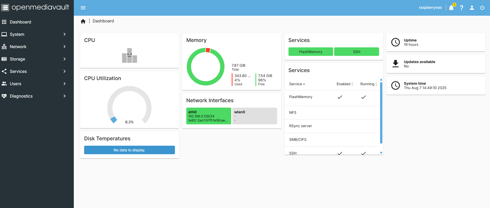

## Table of Contents

- [Hardware](#hardware)
- [Software](#software)
- [Steps](#software)
  * [Step 1](#Step-1-Putting-Together-Raspberry-Pi)
  * [Step 2](#Step-2-Imaging-MicroSD)
  * [Step 3](#Step-3-Downloading-Putty)
  * [Step 4](#Step-4-Launching-Putty)
  * [Step 5](#Step-5-Updating-Raspberry-Pi-Software)
  * [Step 6](#Step-6-OMV-'Preinstaller')
  * [Step 7](#Step-7-OMV-'Installer')
  * [Step 8](#Step-8-OMV-First-Launch)
  * [Step 9](#Step-9-File-System)
  * [Step 10](#Step-10-Shared-Folders)
  * [Step 11](#Step-11-Services)
  * [Step 12](#Step-12-Shared-Folders)
  * [Step 13](#Step-13-Access)
- [Additional Information](#Additional-information)

## Hardware

- [Raspberry Pi 5 8GB Board](https://www.raspberrypi.com/products/raspberry-pi-5/)
- [Raspberry Pi Power Supply](https://www.raspberrypi.com/products/power-supply/)
- [SmartQ C368 USB 3.0 Card Reader](https://www.amazon.com/SmartQ-C368-Multi-Card-Compatible-Supports/dp/B06Y1G18KS/ref=sr_1_2_sspa?crid=19HQN7PU8JP3P&dib=eyJ2IjoiMSJ9.aZ5CyI1seaCTFVUzT0NlJmfjg7SSHll_hQAdXHtwrSBwKkbCL6ckRohEQnsInJFQWmE6hQR3_BpnnJvcb2Cdw0awVMcDG_EGuEvPTnfbm9PPgalPAPpDoxxeNZlnSEem5vg3b4Vas1ItTEVJE8cVNUBWfH3OlzjrlxCBZ1pW4tpVNQhxC0iqVA92NfBV_FCmC9GEnvNcSZfgAh5gzOK_tJp0vJ2PW50Whu2Rg14Dq-8.eKGfn-GLuZlHcV7JqQHPoTmUyelh2tAD_G7z_BEQlB4&dib_tag=se&keywords=micro%2Bsd%2Bcard%2Breader&qid=1754597129&sprefix=micro%2Bsd%2Bcard%2Breader%2Caps%2C153&sr=8-2-spons&sp_csd=d2lkZ2V0TmFtZT1zcF9hdGY&th=1)
- [Micro SD Card 32GB (SanDisc)](https://www.amazon.com/SanDisk-Ultra-microSDXC-Memory-Adapter/dp/B073JWXGNT/ref=sr_1_3?crid=HSH4172HDNGD&dib=eyJ2IjoiMSJ9.jpP4EOL63nLBVDLlKgJCTaPW2W0VsqK5yZ_7voVvVaqushoTQ_rsy881Mun5K74Pz9U24p2IZJsyNSd0bSRDOB7FM3xhx-XPIm_Crvt0_c3y4i8oYCleCovdmtek6Ai97v23xIa65KK8bbifO6YYYK1OFoQEqmZPBs9T1IjaSa_pFkPRMJr8an3dB9DBZJUldoL8jPZpC0Bg-6aD-qSEFnhKLupj9H6L8yhMVZeVtOg.th7dIwozbiIPur_Wz1UK-8p1p08jstssSPlcPhPHfzI&dib_tag=se&keywords=scan%2Bdisk%2Bmicro%2Bsd%2Bcard%2B32gb&qid=1754592882&sprefix=scan%2Bdisk%2Bmicro%2Bsd%2Bcard%2B32gb%2Caps%2C114&sr=8-3&th=1)
- [My Passport - 5TB](https://www.westerndigital.com/products/portable-drives/wd-my-passport-usb-3-0-hdd?sku=WDBPKJ0050BBK-WESN)
- [Vilros Raspberry Pi 5 8GB (Aluminum Black)](https://www.amazon.com/dp/B0CTT6X2ZJ?ref=ppx_yo2ov_dt_b_fed_asin_title&th=1)

- *I utilized the Vilros Raspberry Pi 5 8GB Kit, which included the power supply, microSD card, and various additional accessories as documented in the accompanying photographs and link above. Additionally, I incorporated external hard drives that were available from inventory within my premises.

- You can use the following Raspberry Pi accessories to customize your build to use a SSD or M.2:

- [Raspberry Pi SSD Kit](https://www.raspberrypi.com/products/ssd-kit/)
- [Raspberry Pi M.2 HAT+](https://www.raspberrypi.com/products/m2-hat-plus/)

## Software

- [Raspberry Pi Imager](https://www.raspberrypi.com/products/m2-hat-plus/)
- [Putty](https://www.chiark.greenend.org.uk/~sgtatham/putty/latest.html)
- Raspberry Pi OS Lite (64-bit) [Installation guide](https://www.raspberrypi.com/software/)

- *Implementing a Network-Attached Storage (NAS) system using OpenMediaVault requires a command-line interface (CLI) operating system.

# Steps

## Step 1 (Putting Together Raspberry Pi)
- Due to using the Vilros Raspberry Pi 5 kit, my first step was to put my board together with the case and accessories I would need for the project.
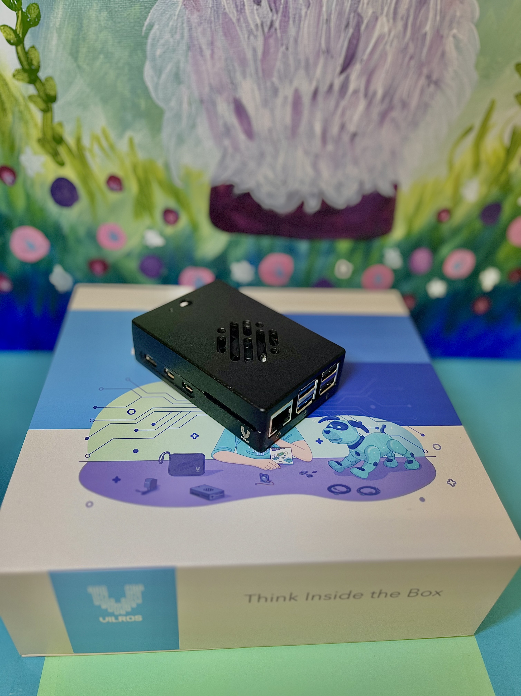

## Step 2 (Imaging MicroSD)
- Install [Raspberry Pi Imager](https://www.raspberrypi.com/products/m2-hat-plus/), this will allow us to put Raspberry Pi OS Lite (64-bit) onto the microSD card
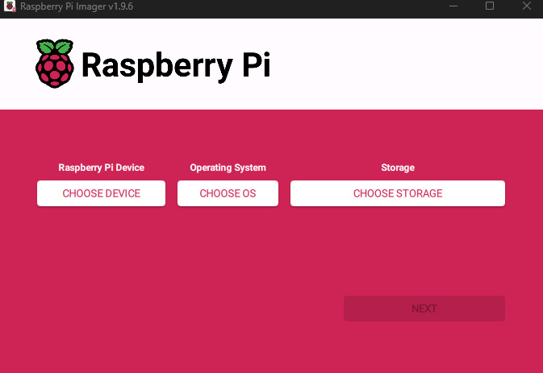
- Select the appropriate Raspberry Pi model, Raspberry Pi OS Lite (64-bit) is found in the category of other, then select the microSD card to load the software onto.

## Step 3 (Downloading Putty)
- While there are different ways to secure shell (SSH) into the Raspberry Pi 5, the means that we will access the Raspberry Pi 5 will be through Putty.
- If you choose to use a different means, skip to [Step 5](#Step-5-Updating-Raspberry-Pi-Software).
- Download [Putty](https://www.chiark.greenend.org.uk/~sgtatham/putty/latest.html).

## Step 4 (Launching Putty)
- You will have to know the IP address for the Raspberry Pi within your network, I simply connected a monitor and keyboard to my Raspberry Pi 5, logged into it, with the user name and password I created using the imager and ran the command 
```bash
# ifconfig
```
- After you know the IP address launch Putty from your main PC
- 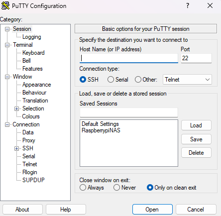
- Put the IP address in the apropriate field and launch.
- *I saved my IP address into my Putty to allow me to have ease of access.

## Step 5 (Updating Raspberry Pi Software)
- Once you have SSH connection into the Raspberry Pi updates are recommended, the following commands are for updates and upgrades to the software:
```bash
# sudo apt update
```
```bash
# sudo apt-upgrade
```
```bash
# sudo reboot
```
- *Each command can take up to several minutes to complete.

## Step 6 (OMV 'Preinstaller')
- This step will utilize the following github script:
```bash
# wget -O -https://github.com/OpenMediaVault-Plugin-Developers/installScript/raw/master/preinstall | sudo bash
```
- *Script can take up to several minutes to complete.

## Step 7 (OMV 'Installer')
- This step will utilize the following github script:
```bash
# wget -O -https://github.com/OpenMediaVault-Plugin-Developers/installScript/raw/master/install | sudo bash
```
- *Script can take up to several minutes to complete. This is where you can either watch the script run its course to see if anything shows red meaning it didnt install correctly, or you can go make yourself a snack.
```bash
# sudo reboot
```

## Step 8 (OMV First Launch)
- In your favorite web-browser, input the IP address of the Raspberry Pi, it will take you to the home screen of OpenMediaVault.
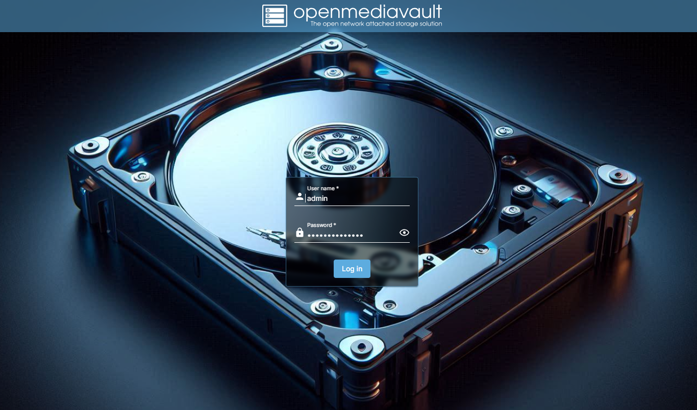
- *Default User: admin
- *Default Password: openmediavault

- [Troubleshooting](https://docs.openmediavault.org/en/latest/troubleshooting.html)
- *I initially encountered difficulties logging in the first time, receiving an incorrect username or password error. After rebooting the Raspberry Pi, the issue was resolved, and I was able to log in successfully.

- ## Step 9 (File System)
-  Prior to establishing the file system we will *need* to **wipe** the HDD, OpenMediaVault requires this for mounting purposes. In the **Storage** section, **Disks**, select the **HDD**, and choose wipe, *quick* will meet the requirements unless you want to conduct a *secure* wipe.
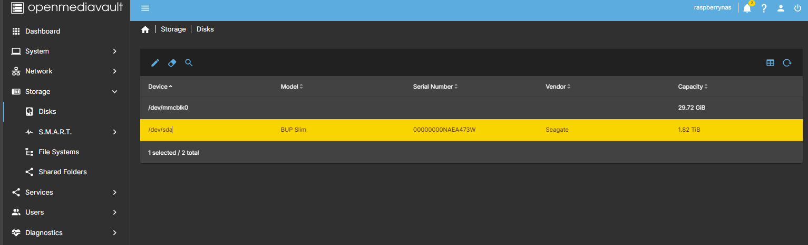

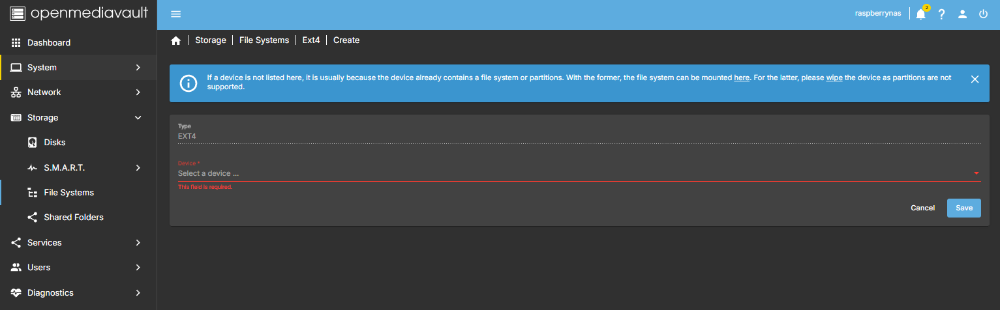

- After the wipe the error will go away and will allow you to create the **File System**


- After it has completed, **Mount** the file system and **Save**.
- **Accept** pending changes on the yellow banner.

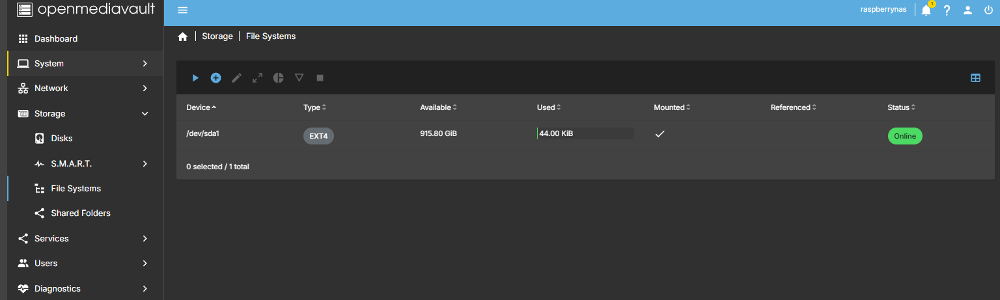

- ## Step 10 (Shared Folders)
- Staying in the **Storage** area, in **Shared Folders**, **Create**, give the directory a name, select the file system that was just created, any additional paths required, change permissions as needed, add tags.
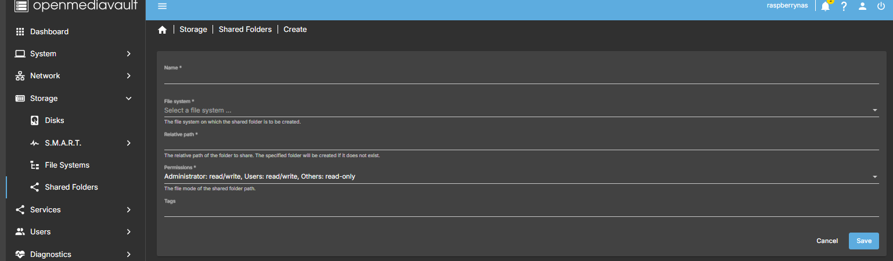

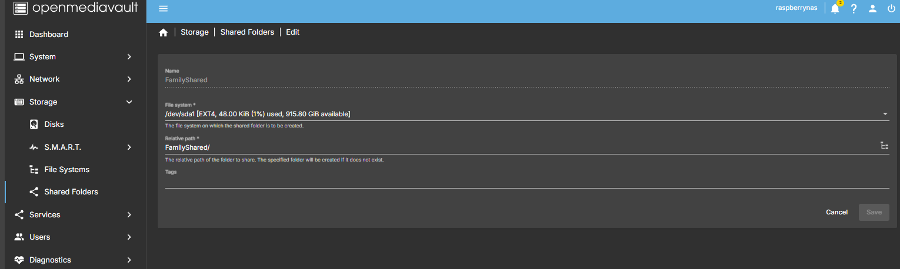

- ## Step 11 (Services)
- Putting the final touches on the NAS would be establishing **Services**, that could be NFS if you are connecting this to a Linux/Unix system or SMB/CIFS for Windows/MAC
- I will be setting this up for SMB as mine will be connected to a Windows network.
- In the **Servies**, **SMB/CIFS**, in settings making sure its enabled, enable the **recycling bin** incase something is deleted it will create a buffer before its deleted forever.
- If its for an older system/network there is a setting within **Advanced Settings** for enabling NetBIOS and WINS server, I will not be enabling those.
- **Save** is located at the very bottom.
- **Accept** pending changes on the yellow banner.
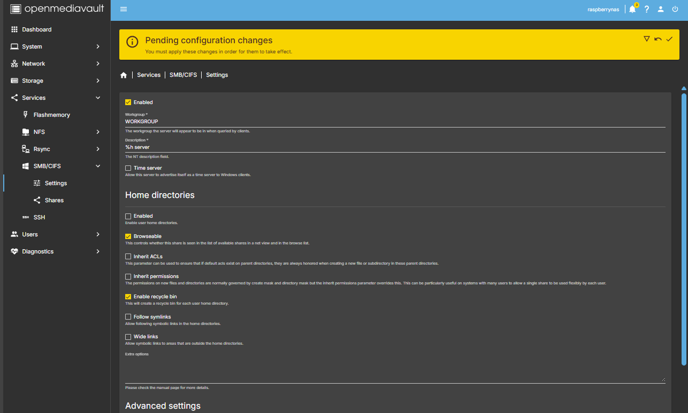

- *You can enable NFS if there is a chance of a Linux based system being connected to the system.

- ## Step 12 (Shared Folders)
- Within **Services**, **SMB/CIFS**, go into **Shares**, **Create**, select the shared folder that was created, **Public** will allow guests to access I left mine set to no, Time Machine Support would be a good feature for MAC users to enable, enable **Recycling bin**
- The rest of the options I left as default.
- **Save** is located at the very bottom again.
- **Accept** pending changes on the yellow banner.
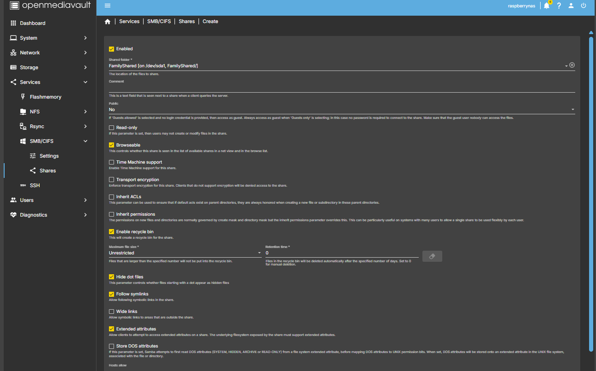

- ## Step 13 (Access)
- When accessing from your PC it will be found within **Network**, when you log in it will be your **User** and **Password** for **OpenMediaVault**.


### Addtional Information

-##[OpenMediaVault FAQs](https://forum.openmediavault.org/index.php?thread/5594-openmediavault-faq/)

-##[OpenMediaVault New User Guide](https://docs.openmediavault.org/en/5.x/new_user_guide/newuserguide.html)

-##[OpenMediaVault Wiki](https://wiki.friendlyelec.com/wiki/index.php/Getting_Started_with_OpenMediaVault)

-##[Enable SSH on Raspberry Pi](https://www.raspberrypi.org/documentation/remote-access/ssh/README.md)

-##[Manual Raspberry Pi OS install](https://www.raspberrypi.com/software/)
