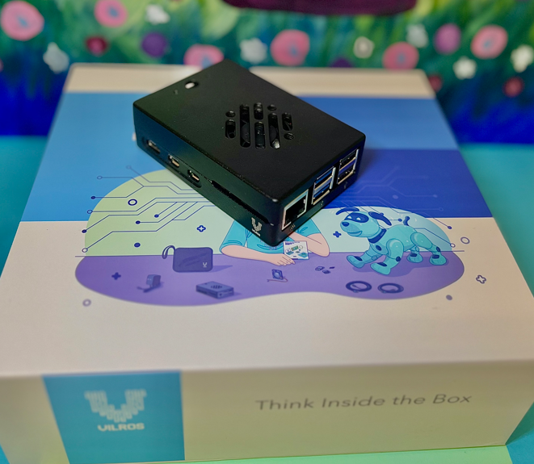

# PiVault: DIY Network Storage with OpenMediaVault
This project involves setting up a cost-effective Network Attached Storage (NAS) solution using a Raspberry Pi 5 (8GB model) and the OpenMediaVault (OMV) operating system. By leveraging affordable and readily available hardware, such as a microSD card and external hard drives, the project guides users through the process of imaging the operating system, configuring NAS features, and managing file sharing services. The resulting system provides reliable, customizable network storage for personal or small office use, utilizing open-source software and compact hardware for maximum flexibility and efficiency.

## Preview

### Dashboard


## Table of Contents

- [Hardware](#hardware)
- [Software](#software)
- [Steps](#software)
  * [Step 1-Putting Together Raspberry Pi 5](#Step-1-Putting-Together-Raspberry-Pi-5)
  * [Step 2-Imaging MicroSD](#Step-2-Imaging-MicroSD)
  * [Step 3-Downloading Putty](#Step-3-Downloading-Putty)
  * [Step 4-Launching Putty](#Step-4-Launching-Putty)
  * [Step 5-Updating Raspberry Pi Software](#Step-5-Updating-Raspberry-Pi-Software)
  * [Step 6-OMV 'Preinstaller'](#Step-6-OMV-'Preinstaller')
  * [Step 7-OMV 'Installer'](#Step-7-OMV-'Installer')
  * [Step 8-OMV First Launch](#Step-8-OMV-First-Launch)
  * [Step 9-File System](#Step-9-File-System)
  * [Step 10-Shared Folder](#Step-10-Shared-Folders)
  * [Step 11-Services](#Step-11-Services)
  * [Step 12-SMB Shares](#Step-12-SMB-Shares)
  * [Step 13-Accessing](#Step-13-Access)
- [Additional Information](#Additional-information)

## Hardware

- [Raspberry Pi 5 8GB Board](https://www.raspberrypi.com/products/raspberry-pi-5/)
- [Raspberry Pi Power Supply](https://www.raspberrypi.com/products/power-supply/)
- [SmartQ C368 USB 3.0 Card Reader](https://www.amazon.com/SmartQ-C368-Multi-Card-Compatible-Supports/dp/B06Y1G18KS/ref=sr_1_2_sspa?crid=19HQN7PU8JP3P&dib=eyJ2IjoiMSJ9.aZ5CyI1seaCTFVUzT0NlJmfjg7SSHll_hQAdXHtwrSBwKkbCL6ckRohEQnsInJFQWmE6hQR3_BpnnJvcb2Cdw0awVMcDG_EGuEvPTnfbm9PPgalPAPpDoxxeNZlnSEem5vg3b4Vas1ItTEVJE8cVNUBWfH3OlzjrlxCBZ1pW4tpVNQhxC0iqVA92NfBV_FCmC9GEnvNcSZfgAh5gzOK_tJp0vJ2PW50Whu2Rg14Dq-8.eKGfn-GLuZlHcV7JqQHPoTmUyelh2tAD_G7z_BEQlB4&dib_tag=se&keywords=micro%2Bsd%2Bcard%2Breader&qid=1754597129&sprefix=micro%2Bsd%2Bcard%2Breader%2Caps%2C153&sr=8-2-spons&sp_csd=d2lkZ2V0TmFtZT1zcF9hdGY&th=1)
- [Micro SD Card 32GB (SanDisc)](https://www.amazon.com/SanDisk-Ultra-microSDXC-Memory-Adapter/dp/B073JWXGNT/ref=sr_1_3?crid=HSH4172HDNGD&dib=eyJ2IjoiMSJ9.jpP4EOL63nLBVDLlKgJCTaPW2W0VsqK5yZ_7voVvVaqushoTQ_rsy881Mun5K74Pz9U24p2IZJsyNSd0bSRDOB7FM3xhx-XPIm_Crvt0_c3y4i8oYCleCovdmtek6Ai97v23xIa65KK8bbifO6YYYK1OFoQEqmZPBs9T1IjaSa_pFkPRMJr8an3dB9DBZJUldoL8jPZpC0Bg-6aD-qSEFnhKLupj9H6L8yhMVZeVtOg.th7dIwozbiIPur_Wz1UK-8p1p08jstssSPlcPhPHfzI&dib_tag=se&keywords=scan%2Bdisk%2Bmicro%2Bsd%2Bcard%2B32gb&qid=1754592882&sprefix=scan%2Bdisk%2Bmicro%2Bsd%2Bcard%2B32gb%2Caps%2C114&sr=8-3&th=1)
- [My Passport - 5TB](https://www.westerndigital.com/products/portable-drives/wd-my-passport-usb-3-0-hdd?sku=WDBPKJ0050BBK-WESN)

- You can use the following Raspberry Pi accessories to customize your build to use a SSD or M.2:
- [Raspberry Pi SSD Kit](https://www.raspberrypi.com/products/ssd-kit/)
- [Raspberry Pi M.2 HAT+](https://www.raspberrypi.com/products/m2-hat-plus/)


- *I utilized the [Vilros Raspberry Pi 5 8GB (Aluminum Black)](https://www.amazon.com/dp/B0CTT6X2ZJ?ref=ppx_yo2ov_dt_b_fed_asin_title&th=1) Kit, which included a power supply, microSD card, and various additional accessories. Additionally, I incorporated external hard drives that were available from my personal inventory within my premises.

## Software

- [Raspberry Pi Imager](https://www.raspberrypi.com/products/m2-hat-plus/)
- [Putty](https://www.chiark.greenend.org.uk/~sgtatham/putty/latest.html)
- Raspberry Pi OS Lite (64-bit) [Installation guide](https://www.raspberrypi.com/software/)

- *Implementing a Network-Attached Storage (NAS) system using OpenMediaVault requires a command-line interface (CLI) operating system.

# Steps

## Step 1 (Putting Together Raspberry Pi 5)
- The initial step involved assembling the Vilros Raspberry Pi 5 kit, including integrating the Raspberry Pi board with the provided case and connecting the necessary accessories essential for the successful execution of the project.



## Step 2 (Imaging MicroSD)
- To begin, install the [Raspberry Pi Imager](https://www.raspberrypi.com/products/m2-hat-plus/) application on your computer. This tool facilitates the straightforward installation of operating system images onto microSD cards. Using Raspberry Pi Imager, select the Raspberry Pi OS Lite (64-bit) image from the available options and write it to your microSD card, preparing the card for use with your Raspberry Pi.


- Begin by launching the Raspberry Pi OS Imager software. Within the application, first select the correct Raspberry Pi model to ensure compatibility with your hardware. For this project, choose the Raspberry Pi OS Lite (64-bit) image, which is located under the “Other” category in the operating system selection menu. This lightweight version is optimized for headless or minimal installations, ideal for running OpenMediaVault without unnecessary graphical overhead.

- Next, carefully select the target microSD card from the list of available storage devices connected to your computer. This microSD card will serve as the primary boot medium for the Raspberry Pi. Verify that the selected microSD card has sufficient storage capacity and no important data remains, as the imaging process will overwrite all existing data on the card.

- Once the OS image and target device are selected, proceed with writing the image onto the microSD card, which will prepare it for deployment in the Raspberry Pi 5 NAS build.

## Step 3 (Downloading Putty)
- Although multiple methods exist to establish a Secure Shell (SSH) connection to the Raspberry Pi 5, this guide uses PuTTY as the preferred client for remote access and system management.
- Download and install [Putty](https://www.chiark.greenend.org.uk/~sgtatham/putty/latest.html) from its official website to proceed with SSH connectivity.
- If you opt to use an alternative SSH client or method, you may skip directly to [Step 5](#Step-5-Updating-Raspberry-Pi-Software).


## Step 4 (Launching Putty)
- To find the IP address of your Raspberry Pi 5 on your network after logging in via connected monitor and keyboard, you can run the following command in the terminal:
```bash
# hostname -I
```
- This command will display the IP address(es) assigned to your Raspberry Pi.
- Alternatively, you can also run:
```bash
# ifconfig
```
- or
```bash
# ip addr show
```
- Use the IPv4 address listed (usually something like 192.168.x.x or 10.x.x.x) to access the device via SSH with PuTTY from your PC)


- *I saved my IP address into my Putty to allow me to have ease of access.

## Step 5 (Updating Raspberry Pi Software)
- Once you have SSH access to the Raspberry Pi, it's recommended to update the system packages to ensure you have the latest security patches and software improvements. The standard commands to update and upgrade the Raspberry Pi OS are:

```bash
# sudo apt update
# sudo apt upgrade -y
# sudo apt full-upgrade -y
# sudo apt autoremove -y
```
- *Each command can take up to several minutes to complete.
- Explanation:
- sudo apt update — Refreshes the list of available packages and their versions.
- sudo apt upgrade -y — Upgrades all the installed packages to their latest versions.
- sudo apt full-upgrade -y — Performs a more complete upgrade, including handling of package dependencies.
- sudo apt autoremove -y — Removes unnecessary packages no longer required by the system.


## Step 6 (OMV 'Preinstaller')
- In this step, we will employ a specialized script hosted on GitHub to automate or facilitate a critical portion of the NAS setup process on the Raspberry Pi 5. This script serves as a pre-configured and tested set of commands or configuration instructions designed to streamline complex or repetitive tasks, reducing manual errors and saving significant setup time.
```bash
# wget -O -https://github.com/OpenMediaVault-Plugin-Developers/installScript/raw/master/preinstall | sudo bash
```
- *Script can take up to several minutes to complete.

## Step 7 (OMV 'Installer')
- This step will utilize another github script:
```bash
# wget -O -https://github.com/OpenMediaVault-Plugin-Developers/installScript/raw/master/install | sudo bash
```
- *Script can take up to several minutes to complete. This is where you can either watch the script run its course to see if anything shows red meaning it didnt install correctly, or you can go make yourself a snack.
```bash
# sudo reboot
```

## Step 8 (OMV First Launch)
- In your preferred web browser, enter the Raspberry Pi’s IP address into the address bar to access the OpenMediaVault home screen.


- *Default User: admin
- *Default Password: openmediavault

- [Troubleshooting](https://docs.openmediavault.org/en/latest/troubleshooting.html)
- *I initially encountered difficulties logging in the first time, receiving an incorrect username or password error. After rebooting the Raspberry Pi, the issue was resolved, and I was able to log in successfully.

- ## Step 9 (File System)
-  Prior to configuring the file system, it is essential to wipe the hard drive, as OpenMediaVault requires a clean disk to properly mount it. Navigate to the **Storage** section and select **Disks**. From the list, choose the target HDD and initiate the wipe process. A *quick* wipe is sufficient for this purpose; however, if you prefer enhanced data security, you may opt for a *secure* wipe instead.


- After it has completed, **Mount** the file system and **Save**.
- **Accept** pending changes on the yellow banner.


- ## Step 10 (Shared Folders)
- In the OpenMediaVault web interface, navigate to the **Storage** section and select **Shared Folders** to create a new network share. Click the *Create* button and provide a clear, descriptive name for the folder.
- Then, select the appropriate file system or storage device that you previously formatted and prepared.
- Specify the directory path where the shared folder will reside, creating subdirectories if needed. Adjust the folder’s ownership and access permissions to suit your security requirements, setting user or group rights for read/write or read-only access.


  

- *You may also add tags or additional descriptions to help identify and organize the share within your NAS environment.
 
- ## Step 11 (Services)
- To complete the NAS setup, the next step is to configure the Services according to your network environment. For Linux or Unix clients, the NFS service is appropriate, whereas for Windows or macOS clients, enabling SMB/CIFS is recommended. In this guide, we'll focus on setting up SMB/CIFS, as the NAS will be integrated into a Windows network.
- Navigate to the Services section and select SMB/CIFS. Ensure the service is enabled by toggling the activation setting. It is also advisable to enable the Recycling Bin feature, which provides a safeguard by temporarily storing deleted files before they are permanently removed, helping prevent accidental data loss.
- For older networks or legacy systems, you have the option within Advanced Settings to enable NetBIOS and the WINS server protocols; however, these are generally unnecessary for most modern setups and will be left disabled in this configuration.
- After making all necessary changes, scroll to the bottom of the page and click Save to apply your settings.
- Finally, confirm and apply the changes by clicking Accept on the yellow notification banner that appears, ensuring the new SMB service configuration is activated.


- *You can enable NFS if there is a chance of a Linux based system being connected to the network.

- ## Step 12 (SMB Shares)
- To configure SMB shares, navigate to Services and select SMB/CIFS, then go to the Shares tab and click Create to add a new share. In the share creation dialog, select the shared folder you previously created as the target folder.
- The Public setting controls guest access; enabling it allows network guests to access the share without authentication, but for security, it is often best to leave this set to No, as in this configuration.
- If you are setting up the NAS for macOS users, enabling Time Machine Support can be beneficial for seamless backup integration. Additionally, enable the Recycling Bin feature to provide a safety buffer by temporarily storing deleted files before permanent removal. The other share options can be left at their default settings.
- After configuring the share, scroll down and click Save to apply the settings.
- Finally, confirm the configuration by clicking Accept on the yellow banner that appears to process pending changes and activate your SMB share.


- ## Step 13 (Access)
- To access the NAS from your PC, navigate to the **Network** section, where the OpenMediaVault server will be listed. When prompted for credentials, enter your assigned **OpenMediaVault** **username** and **password** to log in securely.


### Addtional Information

- [OpenMediaVault FAQs](https://forum.openmediavault.org/index.php?thread/5594-openmediavault-faq/)

- [OpenMediaVault New User Guide](https://docs.openmediavault.org/en/5.x/new_user_guide/newuserguide.html)

- [OpenMediaVault Wiki](https://wiki.friendlyelec.com/wiki/index.php/Getting_Started_with_OpenMediaVault)

- [Enable SSH on Raspberry Pi](https://www.raspberrypi.org/documentation/remote-access/ssh/README.md)

- [Manual Raspberry Pi OS install](https://www.raspberrypi.com/software/)

- [Youtube Video 'The ultimate Raspberry Pi NAS build for 2025!'](https://www.youtube.com/watch?v=xYqkfYmJJ6w&t=562s)
